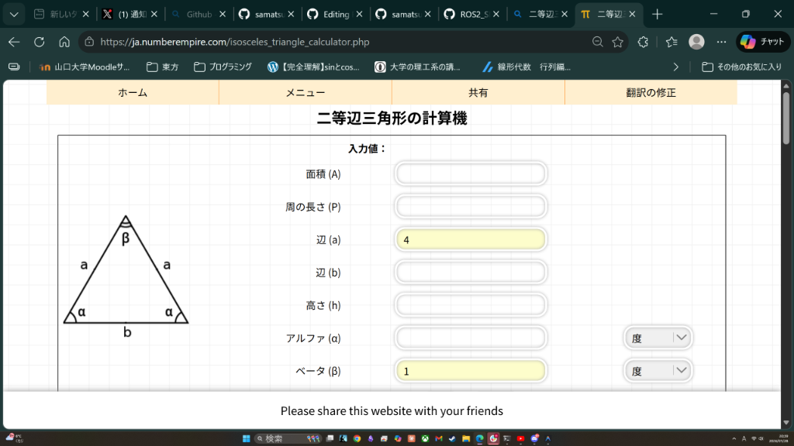
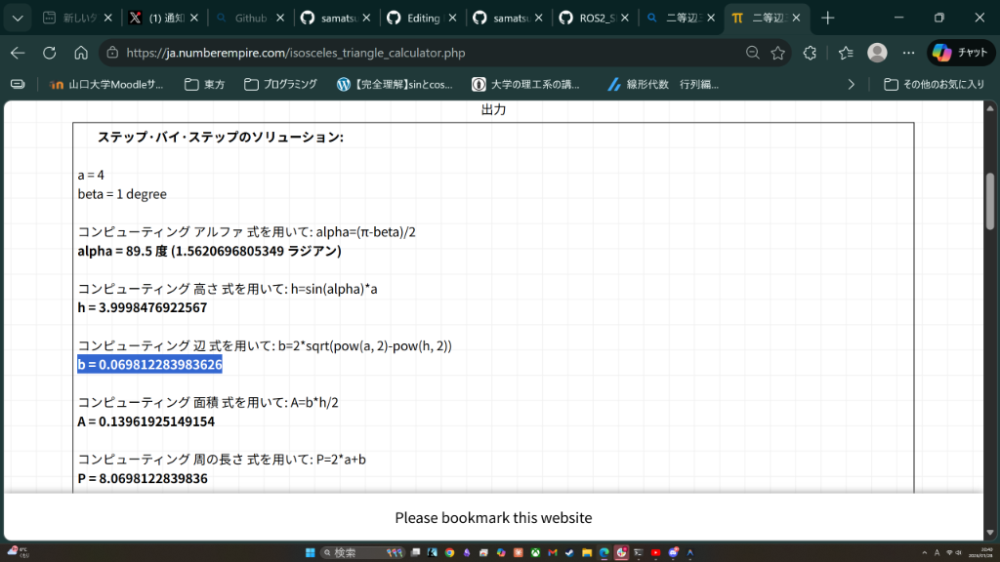

# ログ生成システムと courseLog の仕組み

このドキュメントでは、`gap_follow` パッケージがどのようにして走行データ (`courseLog`) を記録・生成しているかについて、その**目的**と**仕組み**を詳細に解説します。

## 1. ログ作成の目的 (Why?)

このシステムの最大の目的は、単に走行記録を残すことではなく、**「実機で作ろうとしている『マウスセンサーによる自己位置推定（Dead Reckoning）』が、正しく動くか検証するため」** です。

シミュレータ上では、`Odometry`（神の視点からの正確な位置）が得られます。しかし、実機ではそんな便利なものはありません。実機にあるのは「非力なマウスセンサー」だけです。

そこで、このログシステムは以下のことを行っています：

1.  **「もし実機マウスで走っていたら、どんなデータが取れていたか？」** をシミュレータの正確なデータから逆算して生成する（Mickeyデータの生成）。
2.  **「そのマウスデータだけで、元の走行軌跡を再現できるか？」** を計算して検証する（DR経路の復元）。
3.  **「復元した軌跡とLiDARデータを合わせれば、地図が作れるか？」** を可視化する。

つまり、**実機アルゴリズムの予行演習** をログ生成時に毎回行っているのです。

---

## 2. ログ生成の流れ (How?)

プログラム (`data_logger.py`) は、走行中に常にデータを蓄え続け、終了時（Ctrl+C または クラッシュ（壁にぶつかった時のことよん♡）時）に一気に解析・保存を行います。

### Step 1: データの収集 (Recording)
走行中、以下のデータをメモリに貯め込みます。
*   **Odometry (真値)**: 車の正確なワールド座標 $(x, y)$ とワールド向き $\theta$。
*   **LiDAR Scan**: 周囲の壁までの距離データ。

### Step 2: Mickeyデータの生成 (Simulation)
ログ保存の瞬間、蓄積した `Odometry` データ（真値）を使って、マウスセンサーの挙動(すべてローカル座標)をシミュレートします。

*   **なぜやるのか？**: 実機では $500\text{Hz}$ (0.002秒ごと) でマウスからデータが来ますが、ROSのデータはもっと粗いです。そこで、**線形補間** という数学的な処理を使って、「0.002秒ごとの精密な車の位置」をまず復元します。
*   **マウスの動きへの変換**: 復元した車の動きを、前輪と後輪に取り付けたマウスセンサーの動き（ローカル座標系での変位 $\Delta x, \Delta y$）に変換します。

こうして作られるのが `mickey_front.csv`, `mickey_rear.csv` です。これは「実機で取れるはずのミッキーデータ」のコピーです。

### Step 3: 自己位置推定の復元 (Reconstruction)
次に、**「今作った Mickeyデータだけ」** を見て、車がどう走ったかを計算し直します（Dead Reckoning）。

*   **ルール**: ここでは答え（Odometry）を見ることは禁止です。マウスの変位量だけで $\theta$（向き）を計算し、「今こっちに進んでいるはずだ」と推測を積み重ねていきます。
*   **目的**: この計算ロジックが正しければ、計算結果の軌跡は、本来の軌跡と（ほぼ）重なるはずです。

### Step 4: 可視化と検証 (Visualization)
最後に、結果を画像として出力します。

*   **`trajectory_map.png`**:
    *   **赤/青線**: Odometry（真値）の軌跡。
    *   **目的**: 実際にどう走ったかの確認。

*   **`kinematics.png`**:
    *   **シアン色の太線**: Mickeyデータから復元した推定軌跡 (DR Path)。
    *   **背景の薄い線**: Odometry（真値）。
    *   **目的**: **「推定」と「正解」の答え合わせ**。この2本の線が重なっていれば、自己位置推定アルゴリズムは優秀と言えます。ズレていれば、アルゴリズムの改良が必要です。

*   **`mickey_lidar_points.png`**:
    *   **点群**: 推定された位置から見たLiDARデータをプロットして地図を描いたもの。
    *   **目的**: 自己位置推定がズレていないかの最終確認。推定位置が正しければ、壁のラインがきれいに繋がります。推定がズレていると、壁が二重に見えたり歪んだりします。

---

---

## 4. データの中身とアルゴリズム詳細 (Deep Dive)

ここまでは「何をしているか」でしたが、ここでは**「具体的にどんなデータ数値を扱っているのか」**を解説します。

### 🐭 Mickeyデータとは？ (What is it?)

「Mickeyデータ」の正体は、**極めて短い時間（$0.002$秒間）の移動量を表す「小さなベクトル」の集合** です。

実際のログファイル (`mickey_front.csv` など) には以下のような数値が並んでいます。

| Columns | 意味 | 単位 | 解説 |
| :--- | :--- | :--- | :--- |
| **Rel_X** | **局所変位 X** | count (mm) | センサー自身から見て、前後方向に何ミリ動いたか。 |
| **Rel_Y** | **局所変位 Y** | count (mm) | センサー自身から見て、左右方向に何ミリ動いたか。 |
| **Timestamp** | **時刻** | sec | 計測した時刻。 |

#### なぜこれが「ベクトル」なのか？
1行のデータ `(Rel_X, Rel_Y)` は、矢印（ベクトル）を表します。
例えば `(10, 2)` というデータなら、**「この一瞬で、前に10mm、左に2mm進んだ」** ことを意味します。これを**速度ベクトル**と捉えることもできます。

### 📐 どうやって軌跡になるのか？ (Dead Reckoning Logic)

「小さな矢印」を単純に足し合わせるだけでは、カーブを曲がれません（ずっと同じ方向の矢印を足しても直線にしかならないため）。
**「回転」** を考慮して積み上げることで、はじめてカーブを描く軌跡になります。

#### 計算の魔法 (Step-by-Step)

1.  **移動量の差分を見る**:
    *   前輪の移動量 $(D_{front})$ と 後輪の移動量 $(D_{rear})$ を比べます。
    *   もし車が真っ直ぐ走っていれば、前輪も後輪も同じだけ進むはずです $(D_{front} = D_{rear})$。
    *   しかしカーブを曲がる時、前輪と後輪で「横方向のズレ」が生じます。

2.  **角度の変化（回転）を計算する**:
    *   この「ズレ」の量から、車がこの一瞬で「何度回転したか $(\Delta \theta)$」を計算します。
    *   数式イメージ: $\Delta \theta \approx (\text{前輪の横ズレ} - \text{後輪の横ズレ}) / \text{ホイールベース}$

3.  **世界を回転させる**:
    *   車の向き $\theta$ が分かったら、さっきの小さな矢印 `(Rel_X, Rel_Y)` を、地図上の向きに合わせて回転させます。
    *   「自分から見て前の移動」→「地図上で北東への移動」に変換するイメージです。

4.  **地図上に足し込む**:
    *   変換された矢印を、現在の地図上の位置 $(X, Y)$ に足します。これで次の地点が決まります。

これを1秒間に500回繰り返すことで、滑らかな曲線（軌跡）が浮かび上がってくるのです。これこそが **Dead Reckoning（推測航法）** の正体です。

---

### 📡 LIDARスペック (Sensor Specs)

このシステムの設定ファイル (`f1tenth_gym_ros/config/sim.yaml`) で定義されているLIDARの仕様は以下の通りです。
（ユーザーのご指摘通り、一般的なLIDARよりも厳しい条件設定になっています）

| パラメータ | 値 | 説明 |
| :--- | :--- | :--- |
| **有効距離 (Range)** | **4.0m** | 最大で4メートル先までしか見えません。それまた遠くは検知できません。 |
| **スキャン本数** | **200本** | 1回のスキャンで200点の距離データが取得されます。 |
| **視野角 (FOV)** | **約 200度** (-100° ～ +100°) | 車の左右100度ずつを見渡せます（真後ろは見えません）。 |
| **スキャン頻度** | **約 10 Hz** | 0.1秒に1回、周囲の状況を取得します。 |

---

### 🔗 なぜ「0.07m」で点を繋ぐのか？ (Mathematical Reason)

`generate_lidar_points_from_dr` 関数の中で、**「隣り合う点との距離が 0.07m 以下なら線で繋ぐ」** という処理をしています。
この「0.07m」という数字は、適当に決めたものではなく、幾何学的な計算に基づいています。

#### 計算の根拠

LIDARのビームは一定の角度（約1度）で広がっているため、遠くに行けば行くほど、隣り合う点同士の間隔は広くなります。
「一番条件が厳しい場合（最も遠い4m先）」でも、壁として認識できるように限界値を計算しました。

1.  **二等辺三角形で考える**:
    *   LIDARの中心から4m先へのビーム2本（角度差1度）を考えます。
    *   これを二等辺三角形とみなして、底辺の長さ（点と点の間隔）を求めます。

2.  **計算結果**:
    *   計算サイトの結果より、底辺の長さ $b \approx 0.0698\text{m}$ となります。
    *   つまり、4m先にある壁の点同士は約 7cm 離れて計測されます。

#### 結論
**「最も遠い4m地点でも、隣の点までは約0.07mしか離れていないはずだ」**
→ **「逆に言えば、0.07m以上離れているなら、それは連続した壁ではなく、隙間（Gap）である可能性が高い」**

というロジックで、0.07m を閾値として採用しています。

このLIDARデータと、先ほどのDR計算で求めた「車の位置」を組み合わせることで、**「どの場所に壁があったか」** を地図上にプロット (`mickey_lidar_points.png`) することができます。

